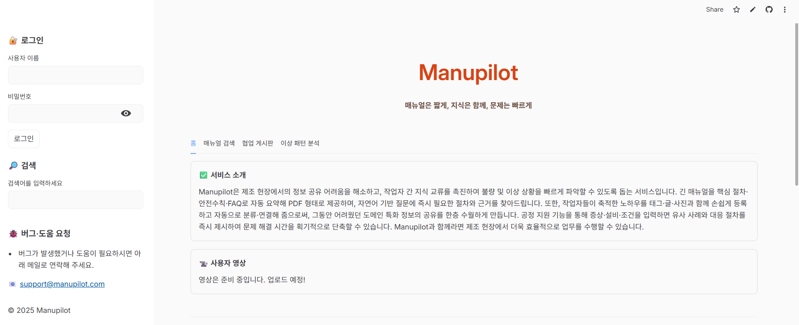

## K Intelligence 해커톤 2025 
Track2 본선: SOTA K 기반의 프롬프트 엔지니어링 <br>
주제: 바이브 코딩 기반 서비스 개발 <br>
결과: 🏆 우수상 (3위) 수상 

## 대회 설명
- 프롬프트 엔지니어링을 기반으로 바이브 코딩(Vibe Coding)을 수행하며, 이를 통해 서비스 개발 전 과정을 완성해야 합니다. <br>
- 대회 과정: 프롬프트 엔지니어링 → 기획서 도출 → 바이브 코딩 → 서비스 개발 및 완성

## 주최 및 주관
- 주최/주관: KT <br>
- 운영: 데이콘

## Manupilot 서비스 소개


- 제조 현장에서 발생하는 매뉴얼 탐색의 비효율성, 교육 부담, 노하우 단절, 불량 대응 지연이라는 네 가지 핵심 문제를 해결하기 위해 설계된 LLM 기반 제조 분야 업무 효율화를 위한 서비스입니다. <br>
- 긴 매뉴얼을 자동으로 요약하고 검색한 내용을 RAG 기반으로 즉시 찾아주며 작업자의 경험을 축적 및 공유하여 현장의 생산성과 안정성을 동시에 높이는 것을 목표로 합니다. 

## Manupilot 기능 
> 매뉴얼 자동 요약: 매뉴얼 PDF를 업로드하면 핵심 절차, 안전 수칙, FAQ를 자동 추출해 요약 카드로 제공합니다. <br>
> 매뉴얼 기반 검색: 매뉴얼 내용을 기반으로 질문하면 관련 문단을 찾아 근거와 함께 즉시 답변합니다. <br>
> 현장 작업자 노하우 게시판: 작업자가 등록한 노하우를 코사인 유사도 기반으로 관련 내용을 자동으로 분류하고 공유합니다. <br>
> 장비 센서 로그 이상 감지: 센서 로그를 분석해 임계치 초과 시 원인 및 조치 체크리스트와 함께 이메일로 알림을 발송합니다. <br>


## 기술 스택

| 분류 | 기술 |
|------|------|
| LLM | SOTA K (GPT-4o 기반) |
| RAG | LangChain + FAISS |
| Frontend | Streamlit |
| Backend | FAST API |

---

# 🧠 프롬프트 전략

Instruction / Context / Input Data / Output Indicator 4요소 구조화로 LLM 출력 일관성 확보.
페르소나(현장 작업자·엔지니어·신입)별 응답 최적화, Few-shot + CoT 기법 적용.

---

# 🚀 실행 방법
```bash
git clone https://github.com/YOUR_USERNAME/manupilot.git
cd manupilot
pip install -r requirements.txt
cp .env.example .env
streamlit run app.py
```

---

> 한계: 실제 제조 데이터 검증 필요 / 추후 MES·PLC 연동 및 다국어 지원 예정
